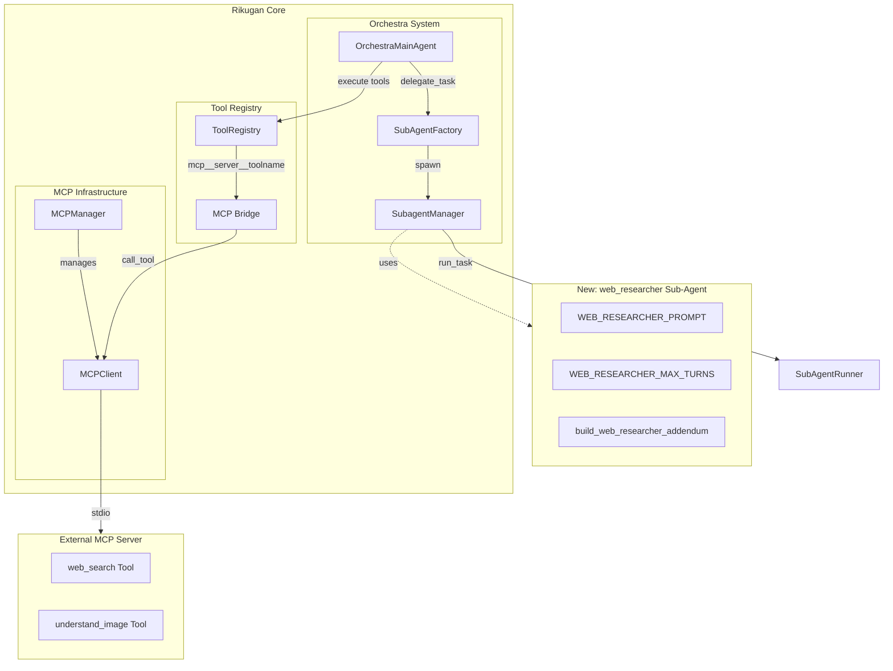
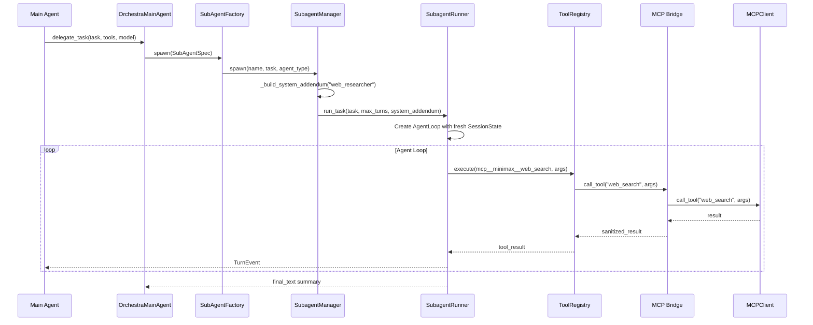
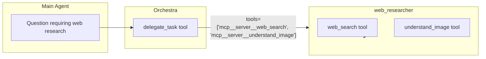
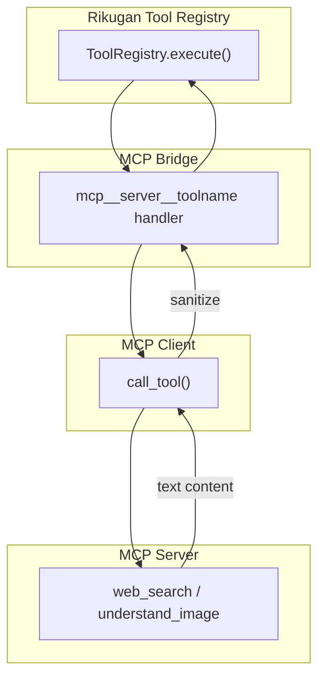

# Web Researcher Sub-Agent Architecture Design

## 1. Overview

This document describes the architecture for implementing a new `web_researcher` sub-agent in Rikugan that leverages MCP (Model Context Protocol) tools for web search and image understanding capabilities.

---

## 2. Component Architecture

### 2.1 High-Level System Diagram



### 2.2 Component Interaction Sequence



---

## 3. File Structure

### 3.1 New Files to Create

```
agent/agents/
├── web_researcher.py          # NEW: Main sub-agent definition
    
plans/
└── web_researcher_design.md   # This document
```

### 3.2 Modified Files

| File | Modification |
|------|--------------|
| [`agent/subagent_manager.py`](agent/subagent_manager.py) | Add handling for `web_researcher` agent type in `_build_system_addendum()` and `spawn()` |
| [`mcp/config.py`](mcp/config.py) | Add `WEB_RESEARCHER_MCP_SERVER` constant (or document server naming convention) |
| `mcp.json` | Add MCP server configuration for web search/image understanding server |

---

## 4. Class Design

### 4.1 New Sub-Agent Definition

**File:** [`agent/agents/web_researcher.py`](agent/agents/web_researcher.py)

```python
"""Web Researcher agent: specialized for web search and image understanding."""

from __future__ import annotations

# System prompt defining the agent's role and capabilities
WEB_RESEARCHER_PROMPT = """\
You are a Web Research specialist. Your task is to find, analyze, and 
synthesize information from the web.

Your capabilities:
- Search the web for information using web_search
- Analyze images (URLs or base64) using understand_image
- Extract relevant facts, code snippets, documentation
- Synthesize findings into a coherent answer

Available MCP tools:
- web_search: Search the web. Input: query (string). Output: search results
- understand_image: Analyze images. Input: image (URL or base64), query (string)

Workflow:
1. Understand the research question
2. Use web_search to find relevant information
3. Use understand_image when images are referenced or relevant
4. Synthesize findings with proper citations
5. Provide a structured, actionable answer"""

# Default perks (optional specialized behaviors)
WEB_RESEARCHER_DEFAULT_PERKS: list[str] = []

# Maximum turns before forcing completion
WEB_RESEARCHER_MAX_TURNS: int = 15


def build_web_researcher_addendum() -> str:
    """Build the full system addendum for a web researcher subagent."""
    from .perks import build_perks_addendum

    perks_text = build_perks_addendum(WEB_RESEARCHER_DEFAULT_PERKS)
    parts = [WEB_RESEARCHER_PROMPT]
    if perks_text:
        parts.append(perks_text)
    return "\n\n".join(parts)
```

### 4.2 Key Classes and Their Responsibilities

| Class/Module | File | Responsibility |
|--------------|------|----------------|
| `WEB_RESEARCHER_PROMPT` | [`web_researcher.py`](agent/agents/web_researcher.py) | Constant string defining agent behavior |
| `WEB_RESEARCHER_MAX_TURNS` | [`web_researcher.py`](agent/agents/web_researcher.py) | Turn limit constant (15) |
| `build_web_researcher_addendum()` | [`web_researcher.py`](agent/agents/web_researcher.py) | Factory function for system prompt |
| `SubagentManager` | [`subagent_manager.py`](agent/subagent_manager.py:50) | Manages sub-agent lifecycle, dispatches to agent-specific prompts |
| `SubAgentFactory` | [`orchestra/subagent_factory.py`](agent/orchestra/subagent_factory.py:14) | Creates sub-agents from `SubAgentSpec` |
| `SubagentRunner` | [`subagent.py`](agent/subagent.py:27) | Executes isolated agent loops |
| `MCPClient` | [`mcp/client.py`](mcp/client.py:76) | Manages MCP server connection and tool calls |

### 4.3 SubagentManager Integration Points

**In [`agent/subagent_manager.py`](agent/subagent_manager.py), add handling for `web_researcher` agent type:**

```python
# In _build_system_addendum() method, add:
elif agent_type == "web_researcher":
    from .agents.web_researcher import build_web_researcher_addendum
    return build_web_researcher_addendum()

# In spawn() method, add override for max_turns:
elif agent_type == "web_researcher":
    from .agents.web_researcher import WEB_RESEARCHER_MAX_TURNS
    max_turns = max_turns or WEB_RESEARCHER_MAX_TURNS
```

---

## 5. Integration Points

### 5.1 Orchestra System Integration

The `web_researcher` sub-agent integrates with the Orchestra system via the existing delegation mechanism:



**Usage via Orchestra:**
```python
# In orchestra.toml or via delegate_task tool:
SubAgentSpec(
    instruction="Research the latest vulnerabilities in OpenSSL",
    tools=["mcp__minimax__web_search", "mcp__minimax__understand_image"],
    model="claude-sonnet-4-20250514",
    max_steps=15,
    name="OpenSSL Vulnerability Research",
    mode="normal"  # or "research" for exploration+notes
)
```

### 5.2 MCP Tool Registration

MCP tools are registered with the Rikugan tool registry via [`mcp/bridge.py`](mcp/bridge.py:53):

```python
# After MCP server starts, tools appear as:
# - mcp__minimax__web_search
# - mcp__minimax__understand_image
```

The tool naming convention: `{MCP_TOOL_PREFIX}{server_name}__{tool_name}`

Where:
- `MCP_TOOL_PREFIX = "mcp_"` (from [`constants.py`](constants.py:30))
- Server name sanitized (replacing `-` and `.` with `_`)

### 5.3 Tool Execution Flow



---

## 6. MCP Server Configuration

### 6.1 Required MCP Server

The `web_researcher` agent requires an MCP server that exposes:
- `web_search(query: string) -> string`
- `understand_image(image: string, query: string) -> string`

### 6.2 Configuration in mcp.json

**File:** `~/.idapro/rikugan/mcp.json` (or equivalent config directory)

```json
{
  "mcpServers": {
    "minimax": {
      "command": "npx",
      "args": ["-y", "@minimax/mcp-server"],
      "env": {},
      "enabled": true,
      "timeout": 30.0
    }
  }
}
```

### 6.3 MCPServerConfig Dataclass

From [`mcp/config.py`](mcp/config.py:19):

```python
@dataclass
class MCPServerConfig:
    name: str           # e.g., "minimax"
    command: str        # e.g., "npx"
    args: list[str]     # e.g., ["-y", "@minimax/mcp-server"]
    env: dict[str, str] # environment variables
    enabled: bool       # whether server is active
    timeout: float      # handshake timeout (default: 30.0)
```

---

## 7. Error Handling

### 7.1 MCP-Related Errors

From [`core/errors.py`](core/errors.py:95):

| Error Class | When Raised |
|-------------|-------------|
| `MCPError` | General MCP protocol error |
| `MCPConnectionError` | Failed to connect to MCP server |
| `MCPTimeoutError` | MCP request timed out |

### 7.2 Error Handling in Sub-Agent Context

The `SubagentRunner` catches exceptions and reports them via `TurnEvent.subagent_failed()`:

```python
# From subagent_manager.py _run_agent():
except Exception as e:
    info.status = SubagentStatus.FAILED
    info.summary = f"Error: {e}"
    self._event_queue.put(
        TurnEvent.subagent_failed(
            agent_id=agent_id,
            name=info.name,
            error=str(e),
        )
    )
```

### 7.3 Sanitization

MCP results are sanitized before entering the conversation to mitigate prompt injection:

From [`mcp/client.py`](mcp/client.py:211):
```python
return sanitize_mcp_result(raw, server_name=self.name, tool_name=name)
```

---

## 8. Implementation Steps

### Step 1: Create Sub-Agent Definition File
**File:** [`agent/agents/web_researcher.py`](agent/agents/web_researcher.py)

- [ ] Define `WEB_RESEARCHER_PROMPT` constant
- [ ] Define `WEB_RESEARCHER_DEFAULT_PERKS` list (can be empty)
- [ ] Define `WEB_RESEARCHER_MAX_TURNS = 15`
- [ ] Implement `build_web_researcher_addendum()` function

### Step 2: Register in SubagentManager
**File:** [`agent/subagent_manager.py`](agent/subagent_manager.py)

- [ ] In `_build_system_addendum()` method, add case for `agent_type == "web_researcher"`
- [ ] In `spawn()` method, add case for `agent_type == "web_researcher"` to override max_turns

### Step 3: Configure MCP Server
**File:** `mcp.json` in Rikugan config directory

- [ ] Add MCP server configuration with `web_search` and `understand_image` tools
- [ ] Verify server starts and tools are registered

### Step 4: Verify Integration
**Testing checklist:**

- [ ] Sub-agent spawns via Orchestra `delegate_task`
- [ ] `web_search` tool is accessible and returns results
- [ ] `understand_image` tool is accessible and analyzes images
- [ ] Error handling works (connection failure, timeout)
- [ ] Results are properly sanitized
- [ ] Max turns enforcement works

---

## 9. Usage Examples

### 9.1 Via Orchestra (Recommended)

```python
# The main agent would delegate:
delegate_task(
    task="Research cryptographic vulnerabilities",
    instruction="Research recent cryptographic vulnerabilities in widely-used libraries. Focus on CVE disclosures and patches.",
    context="Binary analysis found references to OpenSSL 1.1.1 functions",
    tools=["mcp__minimax__web_search", "mcp__minimax__understand_image"],
    model="claude-sonnet-4-20250514",
    max_steps=15,
    mode="research"
)
```

### 9.2 Via SubagentManager Directly

```python
from agent.subagent_manager import SubagentManager

manager = SubagentManager(provider, tool_registry, config, "IDA Pro")

# Spawn web_researcher agent
agent_id = manager.spawn(
    name="Crypto Vuln Research",
    task="Research recent vulnerabilities in OpenSSL 1.1.1",
    agent_type="web_researcher",
    max_turns=15
)
```

### 9.3 MCP Tool Direct Usage

```python
from mcp.manager import MCPManager

mcp_manager = MCPManager()
mcp_manager.load_config()
mcp_manager.start_servers(registry)

# Get client and call tools directly
client = mcp_manager.get_client("minimax")
if client:
    result = client.call_tool("web_search", {"query": "OpenSSL CVE 2024"})
    result = client.call_tool("understand_image", {
        "image": "https://example.com/chart.png",
        "query": "What cryptographic algorithm is shown?"
    })
```

---

## 10. Alternative Design: Direct MCP Sub-Agent

An alternative approach would be creating a dedicated `MCPSubAgent` class that directly wraps MCP client access, bypassing the general `SubagentRunner`. However, this is **not recommended** because:

1. **Duplication**: Would replicate existing `SubagentRunner` functionality
2. **Complexity**: Adds new class without proportional benefit
3. **Consistency**: All sub-agents should use the same execution model

The current design leverages existing infrastructure, which is the established pattern in Rikugan (as seen with `ida_code_reader`, `ida_docs_searcher`, etc.).

---

## 11. Summary

The `web_researcher` sub-agent follows the established pattern in Rikugan:

1. **Definition**: Single Python file in [`agent/agents/`](agent/agents/) with prompt, constants, and builder function
2. **Integration**: Two small additions to [`subagent_manager.py`](agent/subagent_manager.py)
3. **MCP Tools**: Already supported by existing infrastructure
4. **Orchestra**: Compatible via `delegate_task` tool

This design minimizes changes while providing full web search and image understanding capabilities to sub-agents.