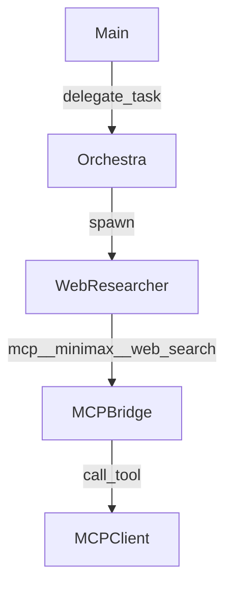
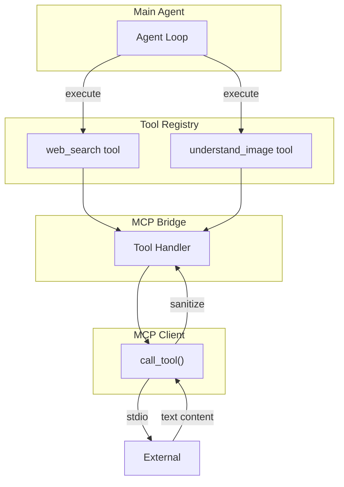
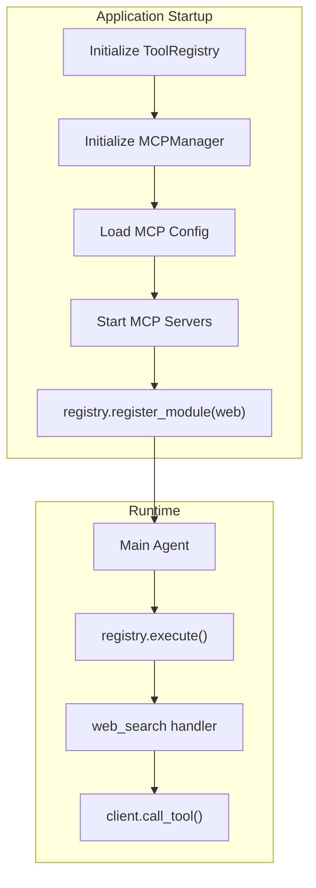

# Web Researcher Tools Architecture Design

## 1. Overview

This document describes the architecture for implementing `web_search` and `understand_image` as **direct tools** (not sub-agents) in Rikugan. This approach enables the main agent to call these capabilities directly without orchestration delegation.

### Design Philosophy

- **Direct Tool Access**: Main agent calls `web_search`/`understand_image` directly via ToolRegistry
- **MCP Backend**: Tools internally leverage existing MCP infrastructure
- **Unified Interface**: Clean tool names without `mcp__servername__` prefix
- **Minimal Complexity**: No sub-agent spawning, orchestration, or delegation overhead

---

## 2. Architecture Comparison

### 2.1 Previous Sub-Agent Approach (Discarded)



**Issues:**
- Heavy: requires sub-agent lifecycle management
- Indirect: extra hop through Orchestra delegation
- Complex: separate system prompt, max_turns, perks needed
- Overkill: for just two tool capabilities

### 2.2 New Direct Tool Approach



**Benefits:**
- Lightweight: direct tool execution
- Simple: no orchestration overhead
- Clean: user-friendly tool names
- Standard: follows existing `@tool` decorator pattern

---

## 3. Tool Architecture

### 3.1 Two Implementation Strategies

#### Strategy A: MCP Proxy Tools (Recommended)

Create wrapper tools that proxy to the underlying MCP tools. The handler simply calls the MCP tool and returns the result.

```python
@tool(name="web_search", description="Search the web for information", category="web")
def web_search(query: Annotated[str, "Search query"]) -> str:
    """Search the web for information."""
    # Get MCP client and call the underlying tool
    client = MCPManager.get_client("minimax")
    return client.call_tool("web_search", {"query": query})
```

**Pros:**
- Minimal code
- Reuses existing MCP infrastructure
- Automatic tool schema from MCP

**Cons:**
- Depends on MCPManager being accessible
- Schema must be manually defined (not auto-generated from MCP)

#### Strategy B: Direct MCP Integration

Create tools that directly use the MCP client without the `mcp__` prefix.

```python
@tool(name="web_search", category="web")
def web_search(query: Annotated[str, "Search query"]) -> str:
    """Search the web for information."""
    from ..mcp.manager import MCPManager
    client = MCPManager.get_instance().get_client("minimax")
    if not client:
        raise ToolError("MCP client 'minimax' not available")
    return client.call_tool("web_search", {"query": query})
```

### 3.2 Tool Schema Design

#### web_search Tool

| Field | Value |
|-------|-------|
| Name | `web_search` |
| Description | Search the web for information using the configured search provider |
| Category | `web` |
| Parameters | `query: string` (required) |
| Returns | `string` - Search results |
| Timeout | 30 seconds |

#### understand_image Tool

| Field | Value |
|-------|-------|
| Name | `understand_image` |
| Description | Analyze an image (from URL or base64) and answer questions about it |
| Category | `web` |
| Parameters | `image: string` (required), `query: string` (required) |
| Returns | `string` - Analysis results |
| Timeout | 60 seconds |

---

## 4. File Structure

### 4.1 New Files

```
rikugan/
├── tools/
│   └── web.py                      # NEW: Web search and image understanding tools
└── plans/
    └── web_researcher_tools_design.md   # This document
```

### 4.2 Modified Files

| File | Modification |
|------|--------------|
| [`tools/__init__.py`](tools/__init__.py:1) | Add `from . import web` to register web tools |
| [`mcp/manager.py`](mcp/manager.py:155) | (Optional) Add `get_instance()` singleton method |

### 4.3 Unchanged Files

- `mcp/bridge.py` - No changes needed; MCP tools still available as `mcp__minimax__*`
- `mcp/client.py` - No changes needed
- `tools/base.py` - No changes needed; `@tool` decorator works as-is
- `tools/registry.py` - No changes needed; standard registration applies

---

## 5. Class Design

### 5.1 New Module: tools/web.py

```python
"""Web search and image understanding tools.

These tools provide a unified interface to MCP-backed web capabilities
without requiring sub-agent orchestration.
"""

from __future__ import annotations

from typing import Annotated

from ..core.errors import ToolError
from ..core.logging import log_debug
from .base import tool

# Tool constants
WEB_SEARCH_TIMEOUT = 30.0
UNDERSTAND_IMAGE_TIMEOUT = 60.0
DEFAULT_MCP_SERVER = "minimax"


def _get_mcp_client(server_name: str = DEFAULT_MCP_SERVER):
    """Get an MCP client by server name.
    
    Returns the client if available and healthy, None otherwise.
    """
    from ..mcp.manager import MCPManager
    
    # MCPManager is typically accessed via singleton or dependency injection
    # This function provides a clean interface for tool handlers
    try:
        manager = MCPManager.get_instance()
        client = manager.get_client(server_name)
        if client and client.is_healthy:
            return client
    except Exception as e:
        log_debug(f"Failed to get MCP client {server_name}: {e}")
    
    return None


@tool(
    name="web_search",
    description="Search the web for information. Use this when you need to find current events, "
                "technical documentation, or other information from the internet.",
    category="web",
    timeout=WEB_SEARCH_TIMEOUT,
)
def web_search(query: Annotated[str, "The search query to find information"]) -> str:
    """Search the web for information.
    
    Args:
        query: The search query string
        
    Returns:
        Search results as a formatted string
        
    Raises:
        ToolError: If the MCP client is unavailable or the search fails
    """
    client = _get_mcp_client()
    if client is None:
        raise ToolError(
            f"Web search unavailable: MCP client '{DEFAULT_MCP_SERVER}' not connected. "
            "Please ensure the MCP server is configured and running.",
            tool_name="web_search"
        )
    
    log_debug(f"web_search: query={query!r}")
    
    try:
        result = client.call_tool("web_search", {"query": query})
        log_debug(f"web_search: result_len={len(result)}")
        return result
    except Exception as e:
        raise ToolError(f"Web search failed: {e}", tool_name="web_search") from e


@tool(
    name="understand_image",
    description="Analyze an image (from URL or base64) and answer questions about it. "
                "Use this to examine screenshots, diagrams, charts, or any image content.",
    category="web",
    timeout=UNDERSTAND_IMAGE_TIMEOUT,
)
def understand_image(
    image: Annotated[str, "Image to analyze: either a URL (http://...) or base64 encoded data"],
    query: Annotated[str, "Question or analysis request about the image"],
) -> str:
    """Analyze an image and answer questions about it.
    
    Args:
        image: Image source - either a URL pointing to an image, or base64 encoded image data
        query: The question or analysis request about the image
        
    Returns:
        Analysis results as a formatted string
        
    Raises:
        ToolError: If the MCP client is unavailable or image analysis fails
    """
    client = _get_mcp_client()
    if client is None:
        raise ToolError(
            f"Image analysis unavailable: MCP client '{DEFAULT_MCP_SERVER}' not connected. "
            "Please ensure the MCP server is configured and running.",
            tool_name="understand_image"
        )
    
    log_debug(f"understand_image: image_len={len(image)}, query={query!r}")
    
    try:
        result = client.call_tool("understand_image", {"image": image, "query": query})
        log_debug(f"understand_image: result_len={len(result)}")
        return result
    except Exception as e:
        raise ToolError(f"Image analysis failed: {e}", tool_name="understand_image") from e
```

### 5.2 Optional: MCPManager Singleton Access

To enable `_get_mcp_client()` to work cleanly, we may need to add a singleton accessor to `MCPManager`:

**File:** [`mcp/manager.py`](mcp/manager.py:22) - Add class variable and property

```python
class MCPManager:
    """Manages multiple MCP server connections."""
    
    _instance: MCPManager | None = None
    
    def __init__(self):
        # ... existing __init__ code ...
    
    @classmethod
    def get_instance(cls) -> MCPManager:
        """Get the singleton MCPManager instance.
        
        Returns the global MCPManager if one exists.
        Raises RuntimeError if no manager has been created.
        """
        if cls._instance is None:
            raise RuntimeError("MCPManager has not been initialized")
        return cls._instance
```

**Note:** This requires ensuring `MCPManager._instance = self` is set in `__init__` or a separate `create()` factory method.

### 5.3 Alternative: Dependency Injection

If singleton is not preferred, tools can receive the MCP client via closure at registration time:

```python
def create_web_tools(mcp_manager: MCPManager):
    """Factory to create web tools with injected MCP manager."""
    
    @tool(name="web_search", category="web")
    def web_search(query: str) -> str:
        client = mcp_manager.get_client("minimax")
        if not client:
            raise ToolError("MCP client unavailable")
        return client.call_tool("web_search", {"query": query})
    
    return web_search, understand_image
```

---

## 6. Integration

### 6.1 Tool Registration

The web tools are registered via the standard `@tool` decorator pattern:

**File:** [`tools/__init__.py`](tools/__init__.py:1)

```python
"""Shared tool framework: @tool decorator, ToolRegistry, and security helpers."""

from . import base
from . import functions
from . import web          # NEW: Web search and image understanding tools
from .cache import ToolResultCache
from .registry import ToolRegistry

__all__ = ["base", "functions", "web", "ToolRegistry", "ToolResultCache"]
```

**Auto-registration:** When `tools` module is imported, `register_module()` in [`tools/registry.py`](tools/registry.py:94) can be called:

```python
# In your tool initialization code:
registry.register_module(web)
```

### 6.2 MCP Manager Initialization

The `MCPManager` must be initialized before web tools can function. This typically happens at application startup:

```python
# In your application initialization:
from mcp.manager import MCPManager

mcp_manager = MCPManager()  # Sets MCPManager._instance = self
mcp_manager.load_config()
mcp_manager.start_servers(registry)
```

### 6.3 Tool Registry Flow



---

## 7. Usage Pattern

### 7.1 How Main Agent Calls Web Tools

The main agent (via `AgentLoop`) has access to the `ToolRegistry`. Tools are exposed in the system prompt automatically:

```python
# In agent/loop.py or similar:
class AgentLoop:
    def __init__(self, registry: ToolRegistry, provider, ...):
        self.registry = registry
    
    def get_tools_for_prompt(self) -> list[dict]:
        """Return tool schemas for LLM system prompt."""
        return self.registry.to_provider_format()
    
    def execute_tool(self, name: str, arguments: dict) -> str:
        """Execute a tool and return result."""
        return self.registry.execute(name, arguments)
```

### 7.2 Tool Discovery

When `registry.to_provider_format()` is called, web tools appear alongside other tools:

```json
[
  {
    "type": "function",
    "function": {
      "name": "web_search",
      "description": "Search the web for information...",
      "parameters": {
        "type": "object",
        "properties": {
          "query": {"type": "string", "description": "The search query..."}
        },
        "required": ["query"]
      }
    }
  },
  {
    "type": "function", 
    "function": {
      "name": "understand_image",
      "description": "Analyze an image...",
      "parameters": {
        "type": "object",
        "properties": {
          "image": {"type": "string", "description": "Image URL or base64..."},
          "query": {"type": "string", "description": "Question about image..."}
        },
        "required": ["image", "query"]
      }
    }
  }
]
```

### 7.3 Direct Usage Example

```python
# Main agent execution flow:
async def run_agent_loop():
    registry = ToolRegistry()
    mcp_manager = MCPManager()
    mcp_manager.load_config()
    mcp_manager.start_servers(registry)
    registry.register_module(web)  # Register web tools
    
    # Agent loop uses tools
    tool_schemas = registry.to_provider_format()
    # -> Includes web_search and understand_image
    
    # Agent decides to call web_search
    result = registry.execute("web_search", {"query": "OpenSSL CVE 2024"})
    # -> Returns search results string
```

### 7.4 Comparison: Tool vs Sub-Agent

| Aspect | Direct Tool Approach | Sub-Agent Approach |
|--------|---------------------|-------------------|
| **Call Pattern** | `registry.execute("web_search", {...})` | `delegate_task(..., tools=[...])` |
| **Control Flow** | Direct, synchronous | Async, via Orchestra |
| **State** | Stateless | Stateful sub-agent loop |
| **Tool Names** | `web_search`, `understand_image` | `mcp__minimax__web_search`, etc. |
| **Max Turns** | Not applicable | Configured per sub-agent |
| **System Prompt** | Main agent's prompt | Separate web_researcher prompt |
| **Complexity** | Low | High |
| **Latency** | Single round-trip | Multiple round-trips |

---

## 8. Error Handling

### 8.1 Tool-Level Errors

```python
@tool(name="web_search", category="web")
def web_search(query: str) -> str:
    client = _get_mcp_client()
    if client is None:
        raise ToolError(
            "Web search unavailable: MCP client not connected",
            tool_name="web_search"
        )
    try:
        return client.call_tool("web_search", {"query": query})
    except MCPConnectionError as e:
        raise ToolError(f"Connection failed: {e}", tool_name="web_search") from e
    except MCPTimeoutError as e:
        raise ToolError(f"Search timed out: {e}", tool_name="web_search") from e
```

### 8.2 Error Propagation

Errors flow through the standard tool error handling in [`tools/registry.py`](tools/registry.py:176):

```python
# In registry.execute():
except Exception as e:
    raise ToolError(f"Tool {name} failed: {e}", tool_name=name) from e
```

### 8.3 Error Recovery

- **MCP Server Disconnect**: Tool returns error; main agent can retry or continue without
- **Timeout**: Standard tool timeout handling (30s for web_search, 60s for understand_image)
- **Invalid Arguments**: Validation via `_coerce_arguments()` before handler is called

---

## 9. Security Considerations

### 9.1 Result Sanitization

MCP results are sanitized in [`mcp/client.py`](mcp/client.py:211):

```python
return sanitize_mcp_result(raw, server_name=self.name, tool_name=name)
```

This mitigates prompt injection from external MCP servers.

### 9.2 URL Validation

For `understand_image`, URLs should be validated to prevent SSRF:

```python
def _validate_url(url: str) -> bool:
    """Validate that URL is safe to fetch."""
    from urllib.parse import urlparse
    parsed = urlparse(url)
    # Block private IP ranges, localhost, etc.
    return parsed.scheme in ("http", "https")
```

### 9.3 Base64 Size Limits

Limit base64 input size to prevent DoS:

```python
MAX_IMAGE_SIZE = 10 * 1024 * 1024  # 10MB
if len(base64_data) > MAX_IMAGE_SIZE:
    raise ToolError("Image data too large (max 10MB)", tool_name="understand_image")
```

---

## 10. Implementation Steps

### Step 1: Create tools/web.py
- [ ] Create `tools/web.py` module
- [ ] Implement `_get_mcp_client()` helper
- [ ] Implement `web_search()` tool with `@tool` decorator
- [ ] Implement `understand_image()` tool with `@tool` decorator
- [ ] Add appropriate timeout values
- [ ] Add error handling for unavailable MCP client

### Step 2: Update tools/__init__.py
- [ ] Add `from . import web` import

### Step 3: Update MCPManager (Optional)
- [ ] Add `_instance` class variable
- [ ] Add `get_instance()` class method
- [ ] Set `_instance = self` in `__init__`

### Step 4: Register Tools
- [ ] Call `registry.register_module(web)` in application initialization
- [ ] Verify tools appear in `registry.to_provider_format()`

### Step 5: Testing
- [ ] Test `web_search` with various queries
- [ ] Test `understand_image` with URL input
- [ ] Test `understand_image` with base64 input
- [ ] Test error handling (MCP client unavailable)
- [ ] Test timeout behavior

---

## 11. Future Enhancements

### 11.1 Tool Configuration

Add configurable MCP server name:

```python
@tool(
    name="web_search",
    category="web",
    requires=["mcp_client"],  # Declare dependency
)
def web_search(query: str, mcp_server: str = "minimax") -> str:
    client = _get_mcp_client(mcp_server)
    ...
```

### 11.2 Result Caching

Add caching for repeated queries:

```python
from .cache import ToolResultCache

_cache = ToolResultCache()

@tool(name="web_search", category="web")
def web_search(query: str) -> str:
    # Check cache first
    cached = _cache.get("web_search", {"query": query})
    if cached:
        return cached
    # ... execute and cache result
```

### 11.3 Streaming Support

For long search results, add streaming:

```python
@tool(name="web_search", category="web")
async def web_search(query: str) -> str:
    """Search with streaming results."""
    client = _get_mcp_client()
    async for chunk in client.call_tool_streaming("web_search", {"query": query}):
        yield chunk
```

---

## 12. Summary

The direct tool approach provides:

1. **Simplicity**: Single module (`tools/web.py`) with two functions
2. **Standard Pattern**: Uses existing `@tool` decorator and `ToolRegistry`
3. **Direct Access**: Main agent calls tools without orchestration overhead
4. **Clean Names**: `web_search`, `understand_image` instead of `mcp__server__tool`
5. **Minimal Changes**: Only one new file + one import modification
6. **Reusability**: Leverages existing MCP infrastructure

This design replaces the sub-agent approach with a lightweight, maintainable solution that follows Rikugan's established patterns.
